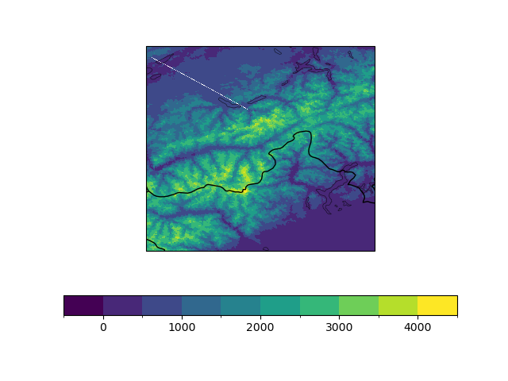
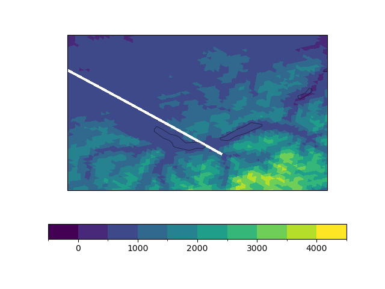

==========
vert_coord
==========

This repo gathers a variety of python scripts to create and evaluate a vertical coordinate for ICON.

.. contents:: **Content**

------------
Installation
------------

This package does not yet comply with high-standard CICD.

Simply init the dedicated conda env with:

``conda env create -f environment.yml``

and later update with:

``conda env update --file environment.yml``

------------------------
Usage of evaluate_hhl.py
------------------------
- ``lev``: Indicate number of levels to be printed
- ``loc``: Locations
- ``grid_file``: ICON grid file
- ``file``: constants file containing HHL
- ``model``: model, either icon or cosmo

Print altitude of levels at specific locations
----------------------------------------------

``python evaluate_hhl.py --print_hhl --lev 35 --loc mtblanc --loc sav --loc zrh --loc ulr --grid_file /store/s83/swester/vert_coord_files/icon-1-alps/alps_DOM01.nc --file /store/s83/swester/vert_coord_files/icon-1-alps/const_sleve.nc``

Print maximum elevation difference between adjacent cells
---------------------------------------------------------
``python evaluate_hhl.py --print_max_dzdc --lev 1 --grid_file /store/s83/swester/vert_coord_files/icon-1-alps/alps_DOM01.nc --file /store/s83/swester/vert_coord_files/icon-1-alps/const_sleve.nc``

-------------------------
Usage of construct_hhl.py
-------------------------
Constructs HHL field from an indicated surface elevation field and other settings. Currently, the script only calculates vct_a and vct_b.

``python construct_hhl.py --file /store/s83/swester/vert_coord_files/icon-1-alps/external_parameter_icon_alps_R19B08_mch.nc --n_levels 81 --h_flat 16000 --top_height 22000 --stretch_fac 0.65 --type_vct_a 2nd_order --type_vct_b linear``

---------------------------------------------------------
plot vertical slices from A to B with losvec_slices.ipynb
---------------------------------------------------------
This is a notebook which was created to play around with slicing "as clean as possible" to be able to visualise a cross-section.

For further usage, it is recommended to use LOSVEC.ipynb.

The cross-section now goes along the following line:

  

---------------------
Usage of LOSVEC.ipynb
---------------------

This is a notebook used to produce a 3D field of LOSVEC coordinates and to visualize a slice of it
using code taken from losvec_slices.ipynb. It can be used by "running all" cells to simply check the
resulting coordinates from the default parameters. 

The main parameters that can be varied are:

1) The input grid file and a corresponding HSURF variable
2) The Gal-Chen vectors **a** and **b**
3) The number of smoothing iterations, the constant *c_smooth* determining the strengh of each 
smoothing iteration, the minimum resulting difference in height of two successive levels 
(default = 15 m), and the maximum change in *dz* (default = 1.5 times the initial one).

The functions that are present in this notebook are described as follows:
- *calc_vct_ab*: Create the Gal-Chen vectors from a desired number of levels, top height,
stretch factor and flat height (see documentation of construct_hhl.py)
- *fill_geofac_div_xr*: Create the divergence geometrical coefficients, used in the following function
- *fill_geofac_n2s_xr*: Create the nabla2_scalar geometrical coefficients, used for the smoothing
- *nabla2_scalar*: Use the geometrical coefficients to obtain the Laplacian of a field defined on the
cells of an ICON grid
- *c_smooth_topo*: Do one iteration of smoothing of a given topology
- *compute_LOSVEC_hhl*: Produce a 3D field of vertical coordinates from the Gal-Chen vectors and 
successive localized smoothings of a given topography.
- *ind_from_lat_lon*: Copied from losvec_slices.ipynb to visualize a slice of the produced field from 
the previous function.

